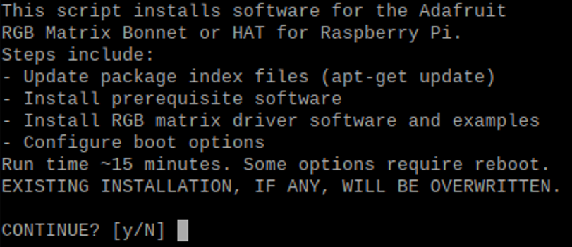
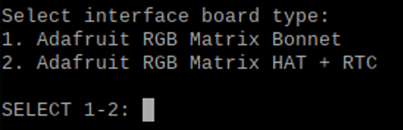
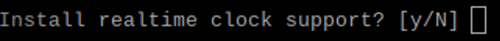
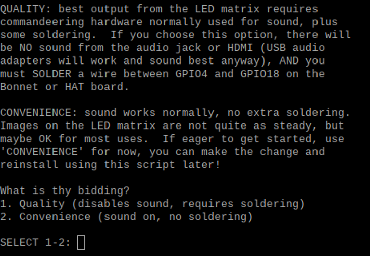
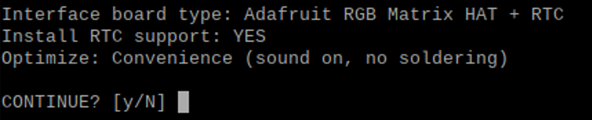
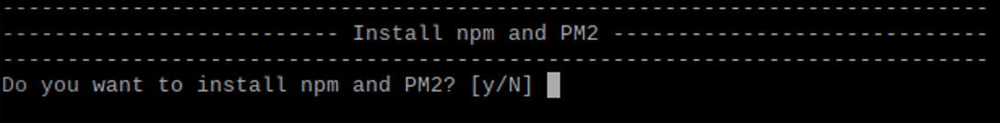
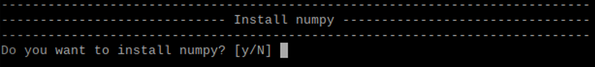
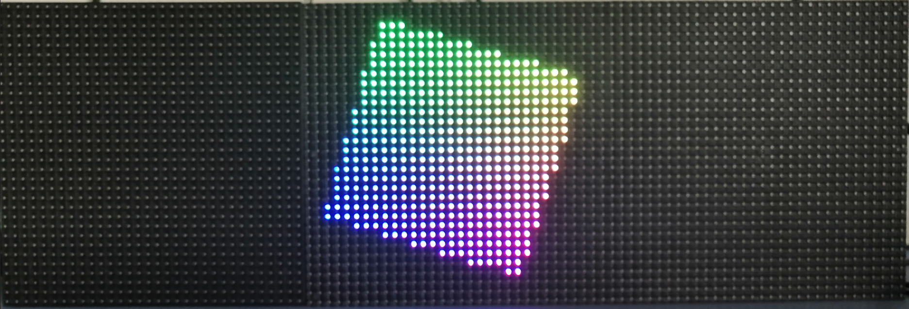
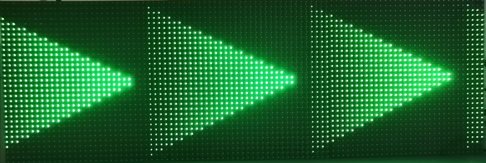
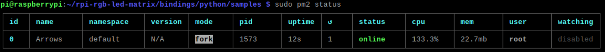

# Driving LED-Matrices

This Folder contains a python script to display moving arrows on a 96*32 LED-Matrix controlled by a Rapberry-Pie and an Adafruit RGB-Matrix HAT + RTC.

## Installation

The [setup.sh](./setup.sh) bash script :

- installs the RPI-RGB-Matrix that drives the LED-Matrices
- installs npm and PM2 to automatically start the Arrows.py script on startup
- installs python libraries
- downloads the necessary [python script](./Arrows.py)

To launch the [setup.sh](./setup.sh), type `bash setup.sh` in the terminal as the user `pi`. You will be asked if you want to insatall the previously mentioned packages and libraries.

### Installation of the RPI-RGB-Matrix package

The installation uses the steps described in [this tutorial](https://learn.adafruit.com/adafruit-rgb-matrix-plus-real-time-clock-hat-for-raspberry-pi/driving-matrices), for more information on how to connect the hardware or the installation, please refer to it. This step will take around 15 minutes.

1. If you want to install or modify your installation of the RPI-RGB-Matrix package, select `Yes`.

    

2. Select the correct interface board (in our case RGB Matrix HAT + RTC).

    

3. Enable realtime clock support.

    

4. Select the "CONVENIENCE" setting. The "QUALITY" setting requires the GPIO4 and GPIO18 pins to be connected. The sound over HDMI and the jack connector will thus be disabled. The "convenience" setting requires no additional soldering but can cause some filckering (more info [here](https://learn.adafruit.com/adafruit-rgb-matrix-plus-real-time-clock-hat-for-raspberry-pi/driving-matrices)).

    

5. Confirm your selections.

    

### Installation of npm and PM2

1. [PM2](https://pm2.keymetrics.io/docs/usage/quick-start/) is a process management software that can run programms, manage their logs and automatically restart them if necessary. If npm and PM2 have not yet been installed, select `Yes`.

    

### Installation of Numpy

1. If NumPy has not yet been installed, select `Yes`.

    

## Controlling the LED-Matrices

### Checking if the matrices work

If you installed the rpi-rgb-led-matrix package using the [setup.sh](./setup.sh) script, you first have to stop the [Arrows.py](./Arrows.py) that is automatically launched with the following command :

```bash
sudo pm2 stop Arrows
```

1. To test the rpi-rgb-led-matrix package, move to the folder with the examples.

    ```bash
    cd ~/rpi-rgb-led-matrix/examples-api-use
    ```

2. Launch one of the examples :

    ```bash
    sudo ./demo -D0 <options>
    ```

    The options specify the number of pixels per row and column, the number of LED-Matrices that are chained, etc. For an exhaustive list of options and examples, type `sudo ./demo --help` in the terminal. In our case, since we use one 32x32 and one 64x32 LED-Panels chained together, the suitable command is :

    ```bash
    sudo ./demo -D0 --led-rows=32 --led-cols=32 --led-chain=3
    ```

<center></center>

### Use python to control the matrices

1. The rpi-rgb-led-matrix package allows the control of the LED-Panels with Python. Move to the folder, where samples of python code are located :

    ```bash
    cd ~/rpi-rgb-led-matrix/bindings/python/samples
    ```

2. Launch the [Greenwave.py](./GreenWave.py) or the [Arrows.py](./Arrows.py) programm :

    ```bash
    sudo python GreenWave.py
    ```

<center></center>

### PM2

[PM2](https://pm2.keymetrics.io/docs/usage/quick-start/) is used to automatically launch [Arrows.py](./Arrows.py) on startup as well as restart the programm after a possible error and logging the output. The configuration is made through the [ecosystem.config.js](./ecosystem.config.js) file. The following commands can be used to control PM2. They should be preceded by `sudo` so that the processes are launched by the root user.

| Command      | Effect |
| ----------- | ----------- |
| pm2 status | Shows all the processes and the associated information (name, id, state, ...) |
| pm2 start \<file, id, name\> | Starts a process. The argument is either the name/id of a preexisting process or the name of a configuration file. |
| pm2 stop \<file, id, name\> | Stops a process. |
| pm2 delete \<id, name\> | Deletes a process. |
| pm2 log | Shows the logs (errors and output) of the processes |
| pm2 save | Saves the context for automatic respawn |
| pm2 startup | Enable automatic startup for the PM2 processes that were saved |

Here is the output for `sudo pm2 status` when [setup.sh](setup.sh) has been succesfully launched.


